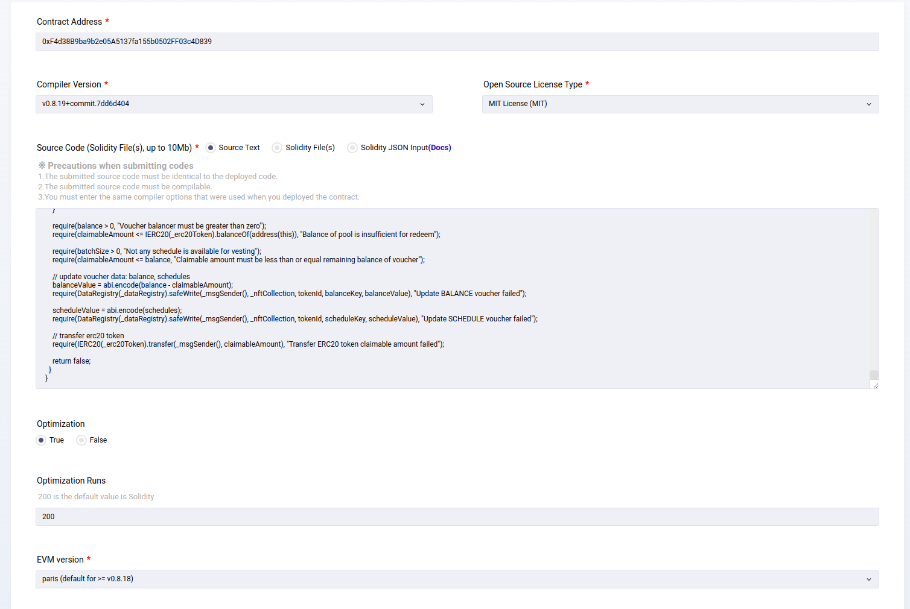
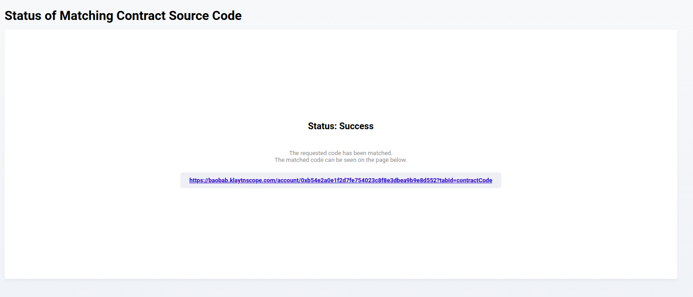
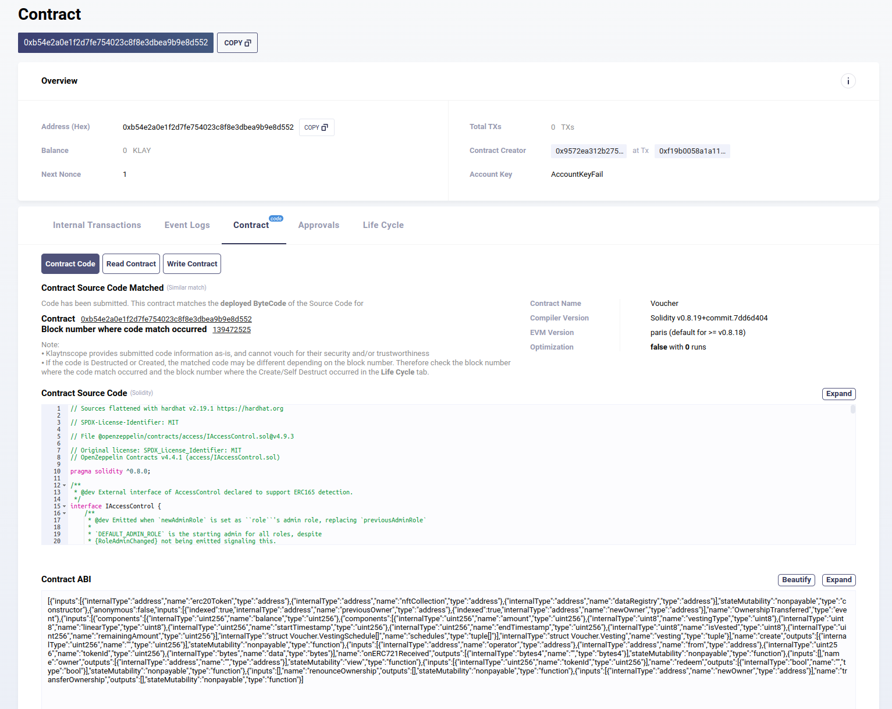

# Verify contract on KlaytnScope

* Unlike Etherscan or BSCscan, Klaytn explorer requires uploading smart contract source code to verify. Furthermore, the uploading source code must be the flatten source code of smart contract, hence each smart contract need to be flatten firstly, by following Hardhat command
```
$ npx hardhat flatten ./contracts/<Contract>.sol > ./flatten/<Flatten-Contract>.sol
```

* Open contract's page on KlaytnScope (the explorer of Klaytn networks), then go through following pages 
  - [Contract](https://baobab.klaytnscope.com/account/<contract-address>?tabId=contractCode) tab, select **Match contract source code**
  - Connect Wallet > Connect to Metamask wallet
  - Fulfill corresponding contract information
    - Contract address: *the deployed address*
    - Compiler version: *v0.8.19+*
    - Open source license type: *MIT licence*
    - Source code: copy/paste the flatten source code taken from previous step
    - Optimization: *True*
    - Optimization runs: *200*
    - EVM version: *paris*
    
  - Sign and submit > Wait for dozen of seconds for Klaytnscope to verify successfully 

* Upon successful verification, contract source code will be available on explorer, on Contract tab of detail page 